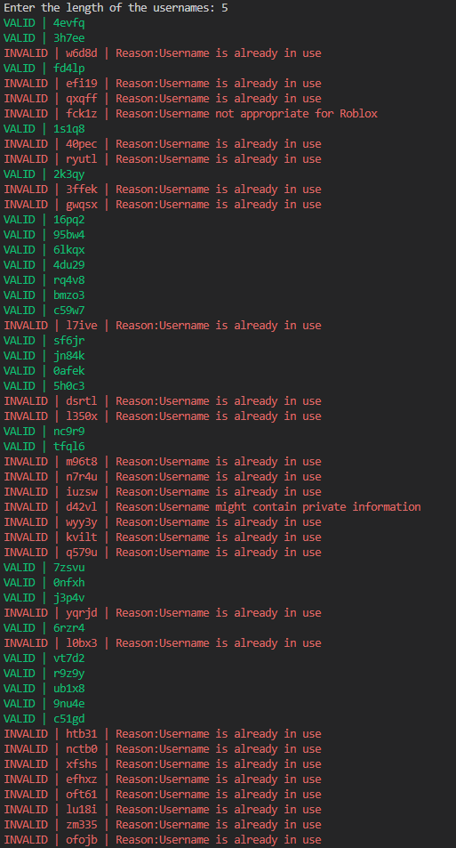

# Username Generator
This is a roblox username generator. It generates usernames based on the character length you want.

# Preview

</img>

# How to use

<p1>

1. Clone the repository

    ```git clone https://github.com/66-75-63-6B-79-6F-75/Username-Gen.git```

2. Open the folder

    ```cd Username-Gen```

3. Install the requirements

    ```pip3 install -r requirements.txt```

4. Run the program

    ```python3 main.py```

5. Enter the length of the username you want

    ```Enter the length of the username you want: 5```

6. Valid usernames are in the file ```valid.txt``` and invalid usernames are in the file ```invalid.txt```


</p1>

# License

<h3>
This project is licensed under the GNU Affero General Public License - see the <a href="https://github.com/66-75-63-6B-79-6F-75/Username-Gen/blob/master/LICENSE">LICENSE</a> file for details.
</h3>